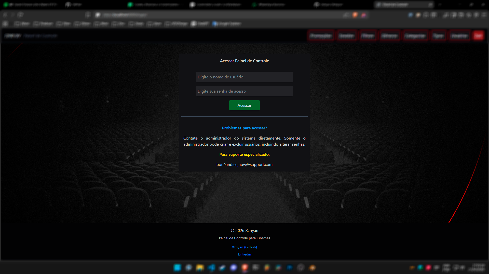
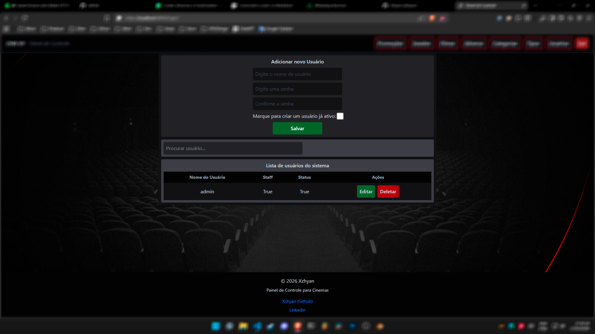
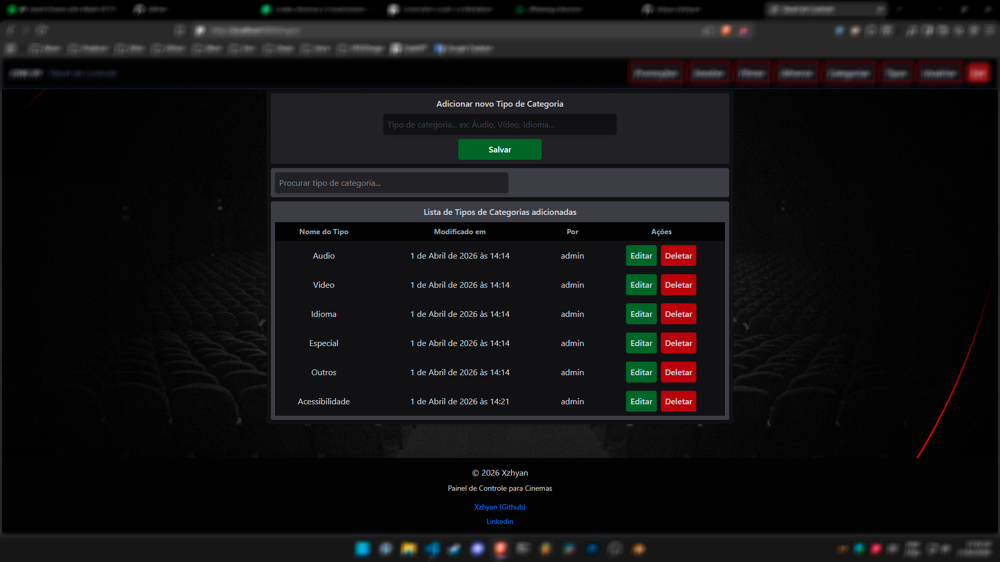

# Website para Cinemas

Sistema para que cinemas publiquem seus filmes em cartaz ou os que chegarão em breve, auxiliando na divulgação, exibindo informações dos filmes, do cinema e disponibilizando links para compra de ingressos online.

## Estrutura do Projeto

- Frontend (React, Tailwind e Django Templates)
- Backend (Django, Django Rest Framework para API)
- Banco de Dados (SQLite3)

## Frontend

A página pública dos filmes é construída utilizando **React e Tailwind**, proporcionando melhor dinâmica e experiência ao usuário.

As páginas administrativas são desenvolvidas com **Django Templates, HTML e Tailwind**, focando na simplicidade e eficiência da administração.

## Backend

O backend foi desenvolvido em **Django**, utilizando o **Django Rest Framework** para fornecer uma API que alimenta a aplicação em React e também gerencia todo o sistema administrativo.

## Banco de Dados

Utiliza **SQLite3**, por ser simples, leve e totalmente suficiente para as necessidades do projeto.

## Tecnologias Utilizadas

- Django
- Django Rest Framework
- React
- Tailwind CSS
- SQLite3

## Licença (Uso do código)

Mesmo o código estando disponível aqui no GitHub e ainda sem uma licença padronizada, siga as regras! Não use o código indevidamente, sem autorização e, principalmente, para fins comerciais.

## Instalação e configuração

Por se tratar de um projeto público aqui no GitHub, porém um projeto que não pode ser utilizado sem autorização, não vi necessidade de mostrar o passo a passo da instalação e configuração do mesmo.

---

## Imagens do Painel de Controle

Como mencionado as páginas administrativas do sistema foram construidas usando Django template com tailwind.

## Mudanças

Colocar opção de upload de imagem do banner

Colocar age of watch para select, e adicionar as opções existentes já 'livre, +14, +18'

Criar uma tabela pra Sessões e Salas