# Painel de Controle de site para Cinemas

> Como o próprio título já indica, o sistema é um painel de controle que gerencia os filmes, sessões e outras informações que são exibidas no site principal.

---

## Sumário

1. [Sobre](#sobre)
2. [Funcionalidades](#funcionalidades)
3. [Tecnologias Utilizadas](#tecnologias-utilizadas)
4. [Requisitos](#requisitos)
5. [Instalação](#instalação)
6. [Configuração](#configuracao)
7. [Uso](#uso)
8. [Estrutura do Projeto](#estrutura-do-projeto)
9. [Créditos](#creditos)
10. [Licença](#licença)
11. [Algumas telas/imagens do sistema](#algumas-telas/imagens-do-sistema)

---

## Sobre

O Painel de Controle foi criado usando Django, templates e, claro, Django REST Framework. Ou seja, ele faz o gerenciamento do banco de dados e envia as informações por API para o site principal, que foi desenvolvido em React. O site principal recebe, organiza e exibe as informações de forma dinâmica, garantindo uma melhor experiência para o cliente.

---

## Funcionalidades

O Painel de Controle possui as seguintes telas para gerenciamento:

1. Usuários
2. Tipos de Categorias
3. Categorias
4. Gêneros
5. Filmes
6. Sessões
7. Promoções

> Em todas as telas é possível listar, criar, editar e deletar informações.

---

## Tecnologias Utilizadas

O sistema foi desenvolvido usando Python, especificamente o framework Django. As telas foram criadas utilizando templates HTML e Tailwind CSS para estilização, e o banco de dados utilizado foi o SQLite.

[Python](https://www.python.org/)
[Django](https://www.djangoproject.com/)
[Django REST Framework](https://www.django-rest-framework.org/)
[Tailwind CSS](https://tailwindcss.com/)
[SQLite](https://sqlite.org/)

## Requisitos

Uma máquina com todas as tecnologias acima instaladas.

## Instalação

Primeiramente, entre em contato comigo para solicitar autorização e negociar formalmente o uso deste sistema. Eu mesmo prestarei suporte para realizar a instalação e as configurações necessárias.

## Configuração

Conforme mencionado anteriormente, eu mesmo prestarei suporte para a realização das configurações necessárias.

## Uso

Da mesma forma o uso do sistemas vai ser mentorado por mim para o comprador do sistema.

## Estrutura do Projeto

Se tratando de um projeto em Django, ele é dividido em apps, sendo eles:

- core: estrutura principal padrão do Django;
- api: envia as informações do banco de dados para o frontend;
- control: onde estão os templates do painel, views, rotas, forms e models, sendo responsável por todo o processo de controle do sistema.

---

## Créditos

### Desenvolvido por [Xzhyan](https://github.com/Xzhyan)

---

## Licença

Este código pode ser utilizado para fins educacionais. A reprodução, modificação ou utilização para fins comerciais é estritamente proibida sem a autorização prévia e expressa do proprietário, [Xzhyan](https://github.com/Xzhyan).

---

## Algumas telas/imagens do sistema.

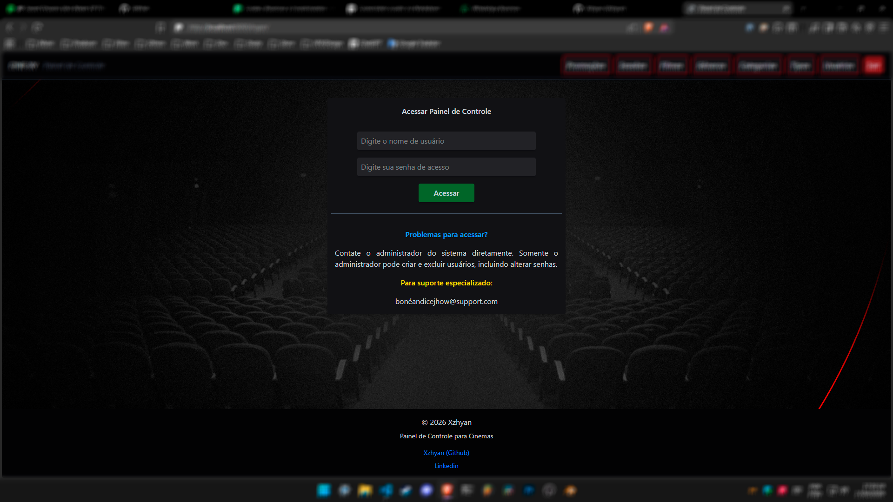
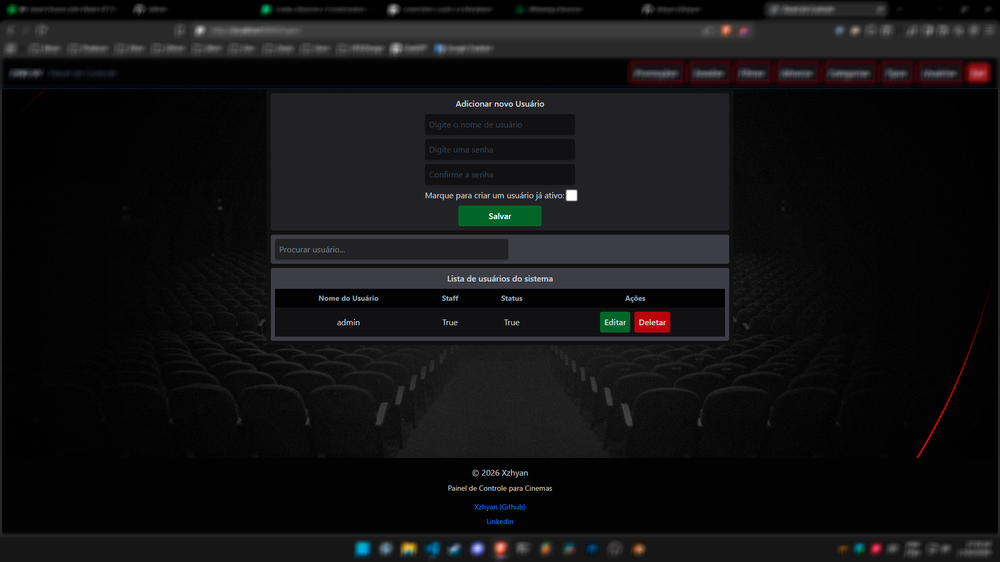
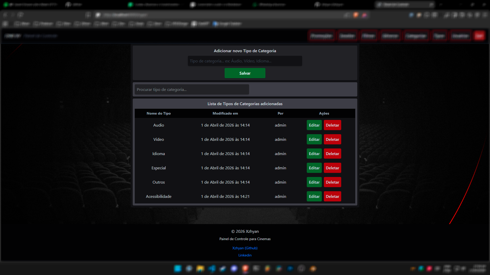
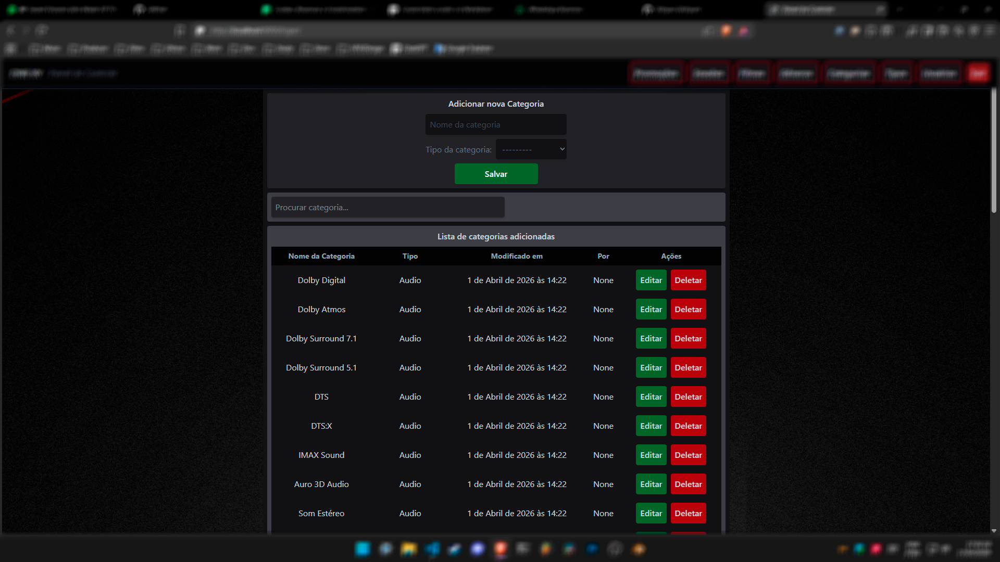
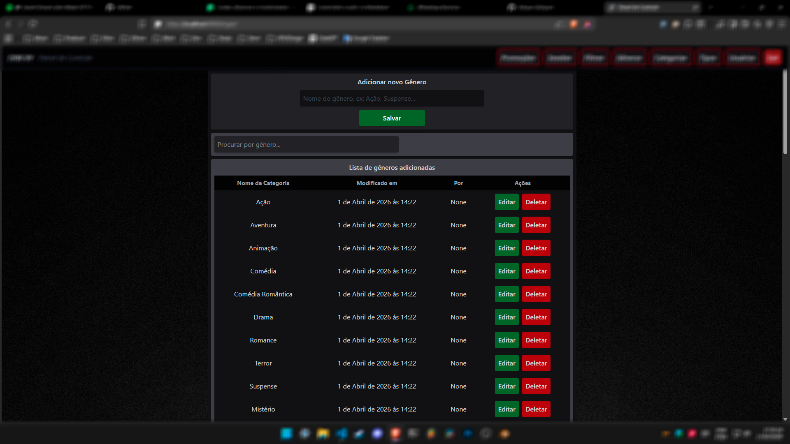
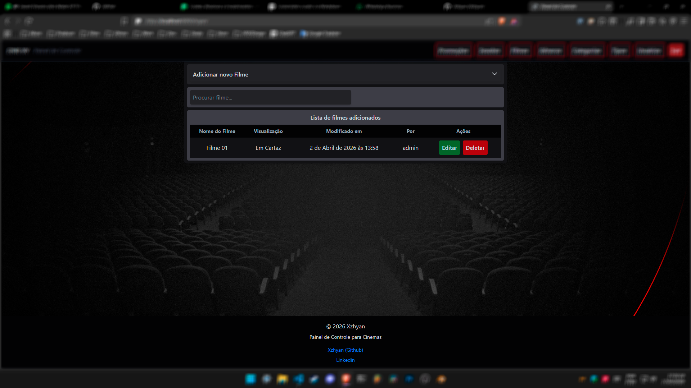
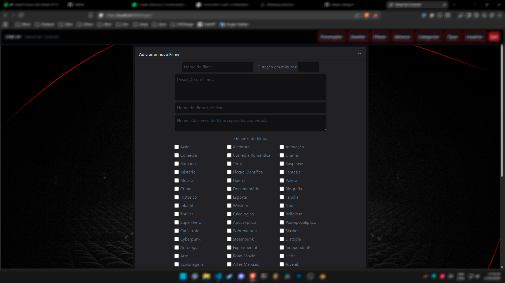
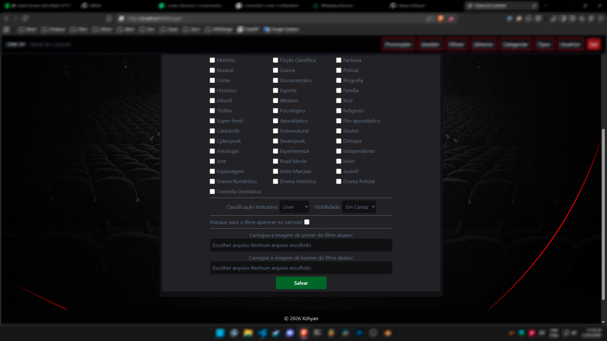
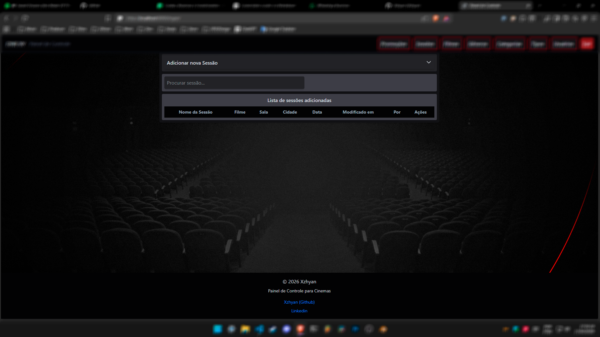
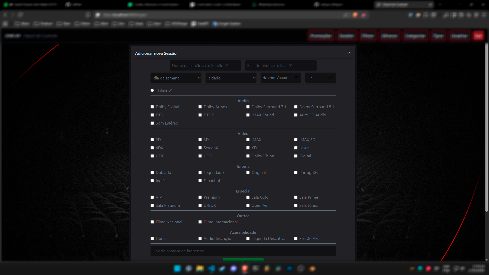
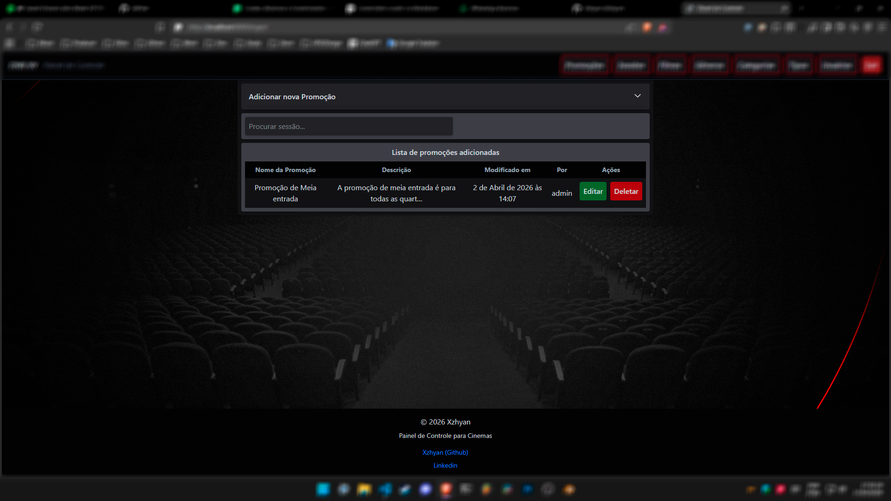
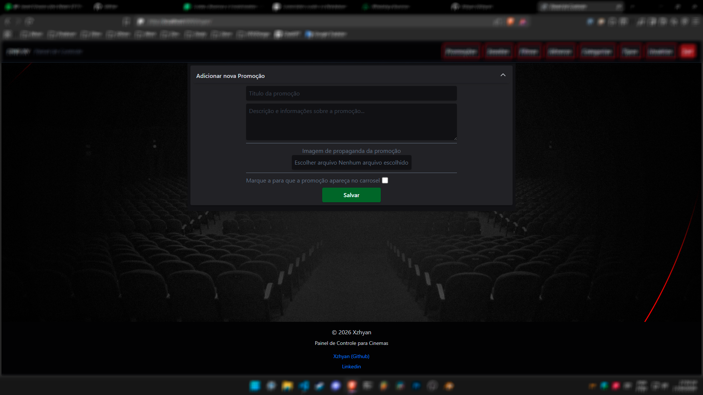

